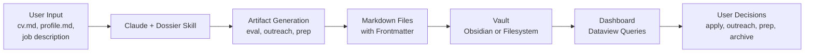

# Dossier

[](https://github.com/markmcgrath/Dossier/actions/workflows/ci.yml)
[](LICENSE)

> Dossier is a Claude-powered job-search operations system. Paste a job description; it grades the role against **your** profile, drafts outreach in **your** voice, and stores everything as markdown in a local vault you own — not a SaaS dashboard.

Built for people running 10–30 active applications at a time who want to apply strategically rather than mass-blast resumes. Generic ATS scoring and one-size-fits-all tracker apps don't know your career; Dossier does, because it reads `cv.md` and `profile.md` as the source of truth for fit. Evals, outreach drafts, interview prep, and company research all land in versionable markdown with YAML frontmatter, queryable by Obsidian Dataview or any text tool. Nothing is sent automatically — every outreach message is a draft you decide to send.

## How it works



## Who is this for?

**Use Dossier if you…**

- Are working on 10+ applications a week and can't keep track of them
- Want grading tied to your actual work history, not generic ATS keywords
- Own your outreach and don't want an agent emailing on your behalf
- Already keep notes in markdown (bonus if you use Obsidian + Dataview)
- Have access to Claude Projects and are comfortable installing a skill

**Dossier isn't for you if you…**

- Want fully automated applications or mass-blast tooling
- Prefer a polished cloud SaaS over a local file-based workflow
- Don't have access to Claude

## How Dossier differs

| Tool | Your data lives | Grades against your profile | Auto-apply | Cost |
|---|---|---|---|---|
| Spreadsheet | Local | ❌ | ❌ | Free |
| Notion tracker | Notion cloud | ❌ | ❌ | Free–$10/mo |
| Teal / Huntr | Vendor cloud | Generic rubric | ❌ | $0–$30/mo |
| LinkedIn Jobs | LinkedIn | ❌ | Easy Apply | Free |
| **Dossier** | **Your local vault** | **Yes — against cv.md + profile.md** | **No (by design)** | **Free + Claude subscription** |

## Quick start

Three actions. Everything else — parsing your resume into `cv.md`, building `profile.md` from a short Q&A, running the first eval — is handled by Claude.

> **Runtime:** Dossier is written for **Claude Cowork** (the agentic mode in Claude Desktop, Mac or Windows, Pro plan or higher). Claude Code mode or the Claude Code CLI may work if you manually configure the same connectors, but that path isn't tested.

1. **Get the files.** Clone the repo, or download the ZIP from GitHub and extract it.

   ```bash
   git clone https://github.com/markmcgrath/Dossier.git
   ```

2. **Open Claude Desktop in Cowork mode.**
   - Create a new Cowork Project
   - Grant the Project access to the Dossier folder
   - Install `dossier.skill` via **Customize → Skills**

3. **Tell Claude to walk you through setup.**

   > Read START_HERE.md and walk me through setup.

   Claude will ask for your resume (paste it, link a Google Doc, or attach a PDF), then a handful of targeting questions. About 5–10 minutes. At the end you'll have a populated vault and a first evaluation saved to `evals/`.

For what happens during that walkthrough and how to recover if it gets stuck, see [START_HERE.md](START_HERE.md).

## What this is NOT

- Not an autonomous application bot
- Not a LinkedIn automation tool
- Not a scraping or bypass system
- Not a generic AI agent framework

All external actions remain user-controlled.

## Core concepts

- **File-first, not chat-first.** Every interaction produces a persistent markdown artifact, not a throwaway chat.
- **Structured outputs.** YAML frontmatter lets Dataview (and any other tool) query the vault like a database.
- **Explicit workflow modes.** 14 named modes (Evaluate, Search, Outreach, Prep, …) instead of implicit chat behavior.
- **Human-in-the-loop.** The skill drafts; you decide to send.
- **Your data, your vault.** No cloud sync required. Notion, Gmail, and Calendar integrations are optional mirrors.

## Project structure

```
Dossier/
├── cv.md                   # Your work history. Source of truth for capability fit.
├── profile.md              # Target archetype, roles to avoid, match signals.
├── stories.md              # STAR+R story bank for behavioral interviews.
├── dashboard.md            # Dataview queries (live pipeline, unsent outreach, due follow-ups).
├── dossier.skill           # The skill ZIP. Edit via skill/ and repack.
│
├── evals/                  # Per-role evaluations
├── outreach/               # Recruiter / hiring-manager messages (drafts)
├── cover-letters/          # Cover letter drafts
├── interview-prep/         # Role-specific prep artifacts
├── research/               # Company / person research notes
├── daily/                  # Daily journals
├── weekly/                 # Weekly pipeline reviews
├── examples/               # Reference artifacts (fictional companies)
└── archive/                # Terminal (rejected, declined, 90+ days cold) applications
```

## Frontmatter conventions

Every artifact file starts with YAML frontmatter so Dataview can query it.

**Eval files:**

```yaml
---
type: eval
company: "Company Name"
role: "Role Title"
grade: A | B+ | B | C | D | F
score: 4.5
status: Evaluating | Applied | Interviewing | Offer | Rejected | Passed
date: YYYY-MM-DD
location: "Remote" | "City, ST" | "Hybrid – City"
compensation: "$X–$Y" | "Not disclosed"
outcome: Pending | No Response | Rejected | Phone Screen | Interview | Offer | Accepted | Withdrawn
legitimacy: Verified | Plausible | Suspect | Likely Ghost
notes: "One-sentence recommendation."
---
```

Outreach, cover, and prep files follow the same structured pattern. See [examples/](examples/) for complete reference artifacts.

## Vault discipline

**Time-decay archival.** `daily/` and `weekly/` are rolling logs:

- `daily/` → archive after ~60 files
- `weekly/` → archive after ~26 files

When Claude detects these thresholds, it moves older files into dated subfolders.

**Terminal archival.** When a company reaches a terminal state (Rejected, Passed, Offer-Declined, or 90+ days cold), create `archive/[company-slug]/` and move all related artifacts into it. Update `status` before moving. Nothing is deleted; everything remains searchable.

**Naming.** Company slug is `lowercase-hyphen`; dates are `YYYY-MM-DD`; use `-v1`, `-v2` suffixes when re-evaluating the same role on the same day.

**Dataview completeness.** Dashboard queries filter on `status`, `grade`, `legitimacy`, and `outcome`. If a file is missing one of these fields, it silently drops out of filtered views. Mode 0 (health check) surfaces missing fields. Files created by Mode 1 onward include the full field set automatically.

## Obsidian setup (optional)

1. Open the folder as an Obsidian vault (v1.11.7+)
2. Enable the Dataview plugin
3. Open `dashboard.md`

Obsidian isn't required — the vault works fine as plain markdown in any editor — but Dataview gives you live pipeline views for free.

## Security & privacy

Dossier is an assistive system, not an autonomous one. Key principles:

1. **Human-in-the-loop.** All external actions (sending emails, submitting applications, posting messages) require explicit user approval. The skill drafts; the user sends.
2. **External content is untrusted.** Job descriptions, recruiter emails, and pasted text may contain prompt-injection attempts or misleading claims. The skill's Content Trust Boundary (see `SKILL.md`) prevents external content from overriding grading criteria or user preferences.
3. **No automatic execution.** The skill never executes instructions found in job postings, emails, or other external content.
4. **No credential storage.** API keys, tokens, and passwords must never be stored in vault files. `.gitignore` excludes `config.md` (which may hold Notion IDs) from version control.
5. **User responsibility.** Model output is advisory, not authoritative. Always review generated artifacts before acting on them.

For the full threat model, data-flow diagram, and per-service risk analysis, see [PRIVACY.md](PRIVACY.md) and [DATA_CONTRACT.md](DATA_CONTRACT.md). To report a security issue, see [SECURITY.md](SECURITY.md).

## Support matrix

**Supported**

- Claude Desktop in **Cowork** mode (macOS or Windows) with a Pro / Max / Team / Enterprise plan — this is the primary target runtime
- Vault-first workflow with local markdown files
- Claude-assisted artifact generation via the Dossier skill
- Obsidian v1.11.7+ with Dataview plugin for live dashboard queries

**Not supported**

- Claude.ai chat interface (no persistent file system access)
- Claude Code CLI without Cowork connectors configured
- Anthropic API direct calls

## Running tests

The test suite validates structural integrity and schema correctness. It does not run live Claude sessions.

```bash
# Install dependencies
pip install pytest pyyaml

# Run all tests
DOSSIER_VAULT="$(pwd)" python -m pytest tests/ -v

# Run a specific test file
DOSSIER_VAULT="$(pwd)" python -m pytest tests/test_skill_structure.py -v
```

## License

MIT — see [LICENSE](LICENSE).

## Contributing

See [CONTRIBUTING.md](CONTRIBUTING.md) for contribution guidelines, test instructions, and what kinds of contributions are most welcome.