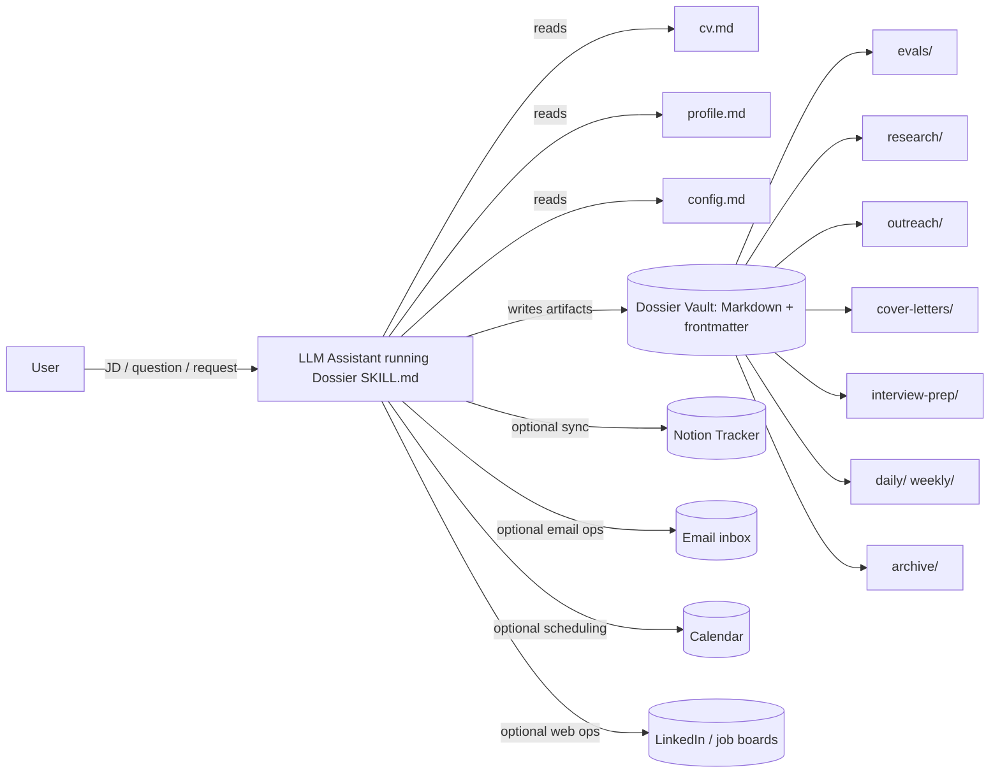
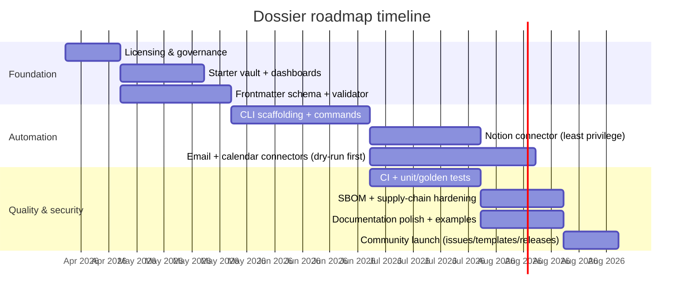

# Deep research assessment of the Dossier career-ops skill

## Executive summary

The provided “Dossier” skill is a **file-first, agent-assisted career operations system** built around **Markdown artifacts** (structured with YAML frontmatter) and a **repeatable evaluation rubric**. The intent is to turn an AI assistant into a **job-search operating model** that produces consistent outputs (job fit evaluations, outreach drafts, cover letters, interview prep, research briefs, negotiation plans) while keeping artifacts **portable, auditable, and easy to search** in a local vault (e.g., an Obsidian vault). The skill also anticipates optional integrations with a structured tracker in entity["company","Notion","workspace and database app"] for pipeline state, and with email/calendar and “browser” workflows for operational execution (follow-ups, scheduling, and LinkedIn work).  

From a software engineering maturity standpoint, the skill is **strong on workflow definition and output structure** (clear mode triggers, consistent file naming, explicit folder taxonomy, explicit scoring dimensions and weights), but **weak on implementation hardening** (no repo packaging, no license file in the provided bundle, no automated validation, no tests/CI pipeline, no security posture statement, and no compliance/ToS safeguards in the supplied files). In the current ecosystem, the closest “full implementations” of this concept are mature, open-source projects like `santifer/career-ops` (large community, legal disclaimers, security policy) that operationalize similar workflows as CLI commands and dashboards. citeturn30view3  

The highest-impact path to “top-tier” status is to evolve Dossier from a prompt+templates bundle into a **versioned open-source project** with: (a) a schema + validator for all Markdown/frontmatter artifacts; (b) optional connectors (Notion, Gmail/Calendar) that run in least-privilege mode; (c) CI, tests, and supply-chain security (SBOM, automated scanning); and (d) explicit ToS/compliance guardrails (especially around entity["company","LinkedIn","professional social network"] automation and job-board scraping). citeturn21search0turn21search1turn23search0turn23search2  

## Project inventory and assessment

### Supplied artifacts and what they define

You supplied two top-level files, plus two files embedded in `dossier.skill`:

- `README.md` (user-facing conventions and folder model)
- `dossier.skill` (a packaged bundle containing)
  - `SKILL.md` (the operational skill definition: modes, triggers, file conventions, output templates, and tracker integration notes)
  - `scoring-guide.md` (a scoring rubric: definitions, weighted dimensions, and grade conversion)

The **core design choice** is a **file-first discipline**: the “truth” of what the AI did is stored as **human-readable Markdown**, organized into a consistent folder taxonomy and named with predictable slugs/dates.

The skill explicitly defines a vault structure centered on a `Dossier/` root with canonical `cv.md` and `profile.md`, a `dashboard.md` for vault queries, and output folders aligned to each mode. For example: `evals/`, `outreach/`, `cover-letters/`, `interview-prep/`, `research/`, and periodic operational folders like `daily/` and `weekly/`. (Source: provided `SKILL.md` excerpt.)

```text
Dossier/
├── cv.md
├── profile.md
├── README.md
├── dashboard.md
├── evals/
├── outreach/
├── cover-letters/
├── interview-prep/
├── research/
├── daily/
├── weekly/
└── archive/
```

A key dependency implied by `dashboard.md` is the entity["company","GitHub","code hosting platform"] community plugin “Dataview” for Obsidian-style vault querying: it treats a vault “as a database,” extracting data from YAML frontmatter and inline fields, and supports both a query language and a JavaScript API. citeturn20view0  

### Purpose and user-visible capabilities

The skill implements an **operational playbook** via “modes.” Each mode has a trigger (“when to use”) and produces structured outputs in a predictable location. The modes defined in the supplied `SKILL.md` include:

- Offer evaluator: job description → scored evaluation + recommendation (Mode 1).
- Job search: find listings by role/location/company type (Mode 2).
- Interview prep: interview plan, likely questions, story bank prompts (Mode 3).
- Company research: deep-dive briefing (Mode 4).
- Outreach: identify contacts and draft messages (Mode 5).
- Cover letter: tailored letter aligned to the role (Mode 6).
- Salary negotiation: negotiation brief and strategy (Mode 7).
- LinkedIn browser ops: perform actions on LinkedIn (Mode 8, high compliance risk).
- Inbox & follow-up: triage recruiter emails and update pipeline (Mode 9).
- Calendar ops: schedule preparation blocks and follow-ups (Mode 10).
- Tailored CV: role-specific CV tailoring (Mode 11).

This is functionally similar (at the workflow level) to more mature “career ops” systems that turn AI agents into a job-search command center, producing standardized artifacts and supporting batch evaluation and dashboards. For example, `santifer/career-ops` advertises a multi-mode system with dashboards, evaluation at scale, and legal disclaimers. citeturn30view3  

### Architecture and data flow

At a high level, the architecture is **document-centric**: inputs and outputs are artifacts, and integrations (tracker, inbox, calendar, browser) are optional execution channels.



**Key architectural strengths**
- **Auditability & portability**: Markdown artifacts are easy to version, review, diff, and migrate across tooling.
- **Determinism via templates**: structured output templates reduce drift and improve comparability across opportunities.
- **Separation of concerns**: narrative artifacts in the vault vs. structured pipeline state optionally in a tracker (Notion), matching the general principle that narrative context and relational pipeline state often diverge in “optimal” storage.  

**Key architectural weaknesses / missing implementation**
- There is **no schema enforcement** for frontmatter fields (risk: dashboards break, scoring becomes inconsistent).
- There is **no automated validation** of naming conventions (risk: artifacts become unqueryable or orphaned).
- There is **no reference implementation** of integrations (Notion/email/calendar/browser), leaving security posture, auth, and data handling undefined.
- There is **no release/distribution model** (no versioning semantics beyond the bundle itself).

### Feature maturity snapshot

Qualitatively, the project is “workflow-mature but engineering-immature.”

- Workflow definition: **high** (clear modes, consistent artifact model, scoring rubric).
- Documentation: **medium** (good internal conventions; lacks installation/runbook for multiple runtimes).
- Automation code: **low** (none included).
- Testing/CI: **none included** in supplied files.
- Security posture: **none included** (no threat model, no disclosure policy, no guardrail statement).
- Legal/compliance: **not addressed** in supplied files; this is important because platform ToS (LinkedIn, Indeed) explicitly restrict automation. citeturn21search0turn21search1  

## Comparable open-source landscape

To ground gaps and best practices, I identified 10 comparable open-source projects that implement parts of the same problem space: job-search operating systems, trackers, automation agents, and “vault-based” workflows.

image_group{"layout":"carousel","aspect_ratio":"16:9","query":["Obsidian Dataview job application tracker dashboard Sankey chart","self-hosted job application tracker dashboard UI"],"num_per_query":2}

### Comparison table of comparable projects

Notes on methodology: community size/activity is approximated using visible GitHub stars/forks and commits; documentation quality is inferred from the presence of setup guides, docs folders, and explicit workflows; CI/tests/security are inferred from visible repo structure such as `.github/workflows`, test folders/configs, and `SECURITY.md` references.

| Project | License | Primary language(s) | Architecture | Feature set overlap with Dossier | Community size/activity | Docs quality | CI/CD | Tests | Security posture | Deployment options | Source |
|---|---|---|---|---|---|---|---|---|---|---|---|
| `santifer/career-ops` | MIT | JavaScript, Go | CLI + Go dashboard + skill modes | Multi-mode job ops, dashboards, evaluation, artifact outputs | 33.3k stars / 6.6k forks / 122 commits citeturn30view3turn33view0 | High (docs + disclaimers) citeturn33view3turn30view3 | Yes (`.github`) citeturn33view0 | Evidence of test scripts (`test-all.mjs`) citeturn33view2 | Has `SECURITY.md` + ToS disclaimers citeturn33view3turn30view3 | Local CLI; project-defined tooling | citeturn33view0 |
| `Gsync/jobsync` (JobSync) | MIT | TypeScript | Self-hosted web app (Next.js) | Tracks applications, matching, AI resume review, analytics | 516 stars / 88 forks / 431 commits citeturn9view0turn9view2 | High (quick start + provider config) citeturn9view1 | Yes (`.github/workflows`) citeturn9view2 | Yes (`__tests__`, `e2e`, jest config) citeturn9view2 | Some security practices implied (auth secret guidance) citeturn9view1 | Docker Compose, self-hosted citeturn9view1 | citeturn9view1turn9view2 |
| `JustAJobApp/jobseeker-analytics` | MIT | TypeScript, Python | Web app + Gmail ingestion | Automated tracking via inbox, dashboarding | 184 stars / 81 forks / 2,434 commits citeturn11view0turn11view3 | High (docs/use cases + deployment) citeturn11view3 | Likely (has `.github`) citeturn34view1 | Not confirmed from root listing | Explicit security orientation (“open for audit”) + `SECURITY.md` citeturn30view4turn34view4 | Docker Compose files present citeturn11view2 | citeturn11view3turn30view4 |
| `1291pravin/job-hunt-ai` | MIT | TypeScript, Vue | Local-first scraper + matcher (Playwright + SQLite) | Job discovery, matching rubric, local data store | 2 stars / 0 forks / 8 commits citeturn32view0turn13view2 | Medium (clear stack + workflow) citeturn13view5 | Unclear | Not found | Emphasizes local privacy, but tool risk from scraping/logins citeturn13view5 | Local; suggests Docker/VPS constraints citeturn13view3turn13view5 | citeturn13view5turn32view0 |
| `reggiechan74/JobOps` | MIT indicated, but README contains conflicting language | HTML/CSS/JS/Shell | Claude-code style command arsenal + artifact folders | Strong overlap: scoring rubrics, file naming conventions, OSINT reports, multi-step resume build | 16 stars / 4 forks / 93 commits citeturn27view3turn27view4turn26view0 | Medium–High (large README, workflow docs) citeturn26view0turn27view0 | Yes (`.github/workflows`) citeturn27view4 | Not established from listing | License inconsistency in docs suggests governance gap citeturn27view2turn27view1 | Local-first; optional tooling (e.g., Playwright MCP) citeturn26view0 | citeturn26view0turn27view1 |
| `feder-cr/jobs_applier_ai_agent_aihawk` | AGPL-3.0 | Python | Automation agent (browser automation) | Automation-heavy job applying | 29.7k stars / 4.5k forks citeturn30view2 | Medium (popular, but risks) | Unknown | Unknown | High compliance/ToS risk; automation posture | Local automation | citeturn30view2turn7view4 |
| `ammarlakis/obsidian-system-job-tracker` | MIT | JavaScript | Obsidian vault template + scripts | Very close in spirit: vault, frontmatter, dashboards, scripts | 6 stars / 0 forks / 4 commits citeturn12view4turn12view2 | High for its scope (install + plugins + scripts) citeturn12view3 | Unknown | Scripted automation exists | Security not addressed; relies on plugin trust | Local vault | citeturn12view3turn12view4 |
| `DrLeucine/obsidian-job-dashboard` | No license found | (Vault / Markdown) | Obsidian dashboard draft (Dataview + Mermaid) | Dashboarding + tracking concepts | 67 stars / 1 fork / 5 commits citeturn15view0 | Medium (explicit draft; minimal docs) citeturn15view0 | Unknown | N/A | License absent (reuse risk) citeturn16view1turn16view0 | Local vault | citeturn15view0 |
| `infews/job_search_in_obsidian` | No license found | (Vault / Markdown) | Obsidian notebook/process repository | Process guidance; vault-based workflow | 44 stars / 4 forks / 5 commits citeturn15view1 | Medium (narrative process docs) citeturn15view1 | Unknown | N/A | License absent (reuse risk) citeturn16view3turn16view2 | Local vault | citeturn15view1 |
| `xitanggg/open-resume` (OpenResume) | AGPL-3.0 | TypeScript | Browser-first resume builder/parser | Strong overlap with Tailored CV intent | 8.5k stars / 975 forks citeturn31view1turn8view6 | High (docs, docker, features) citeturn31view1 | Unclear | Jest config present citeturn31view3 | Emphasizes “runs locally” privacy citeturn7view5 | Local dev + Docker citeturn31view1 | citeturn31view1turn31view3 |

### What the ecosystem suggests for Dossier

Across these projects, the projects that feel “top-tier” share common traits:

- **A working reference implementation** (not just conventions): JobSync and JustAJobApp are deployable systems with clear quick-start paths and ongoing releases. citeturn9view1turn11view0  
- **A security and legal/compliance stance**: career-ops explicitly warns about ToS compliance and model hallucinations and includes security policy files. citeturn30view3turn33view3  
- **Automation + trust boundaries**: Obsidian-based templates work well when they include scripts, dashboards, and clear plugin requirements; however, they still need guidance around plugin trust and safe JavaScript query use. citeturn12view3turn20view0  

## Evidence base from academic and authoritative sources

The project sits at the intersection of **personal information management**, **AI risk management**, **LLM security**, and **career/hiring fairness**. Below are 10 primary sources (standards, academic papers, and authoritative expert commentary) with key findings applicable to Dossier.

| Source | Type | Key findings | Practical implications for Dossier |
|---|---|---|---|
| entity["organization","NIST","us standards agency"] AI RMF 1.0 | Standard (PDF) | Frames AI risk as socio-technical; defines 4 core functions (GOVERN, MAP, MEASURE, MANAGE) and lists trustworthiness characteristics incl. security, privacy, fairness. citeturn35view0 | Add a lightweight “AI risk governance” section: define intended use, failure modes (hallucinations), human oversight, and update cadence for prompts/rubrics. |
| NIST Generative AI Profile (AI 600-1) | Standard (PDF) | A profile for GenAI risk management; emphasizes governance, content provenance, pre-deployment testing, and incident disclosure; explicitly treats GenAI risk as needing tailored actions. citeturn35view1 | Add provenance/traceability fields to artifacts (model used, date, sources), plus an incident/bug reporting workflow for bad outputs or data leaks. |
| entity["organization","OWASP","web security nonprofit"] Top 10 for LLM Applications | Standard | Enumerates common LLM app risks (prompt injection, insecure output handling, supply chain, etc.). citeturn21search3turn24search9 | Use OWASP LLM Top 10 as a checklist for the Notion/Gmail/Calendar integration design; add guardrails for tool invocation and output handling. |
| Liu et al., “Prompt Injection attack against LLM-integrated Applications” | Academic (arXiv) | Explores real prompt injection risks in LLM-integrated apps. citeturn24search0 | Treat external content (emails, job postings, scraped pages) as untrusted; insert a “sanitization + instruction separation” step before tool actions. |
| Greshake et al., “Not what you’ve signed up for” (Indirect Prompt Injection) | Academic (arXiv) | Shows how instructions hidden in retrieved content can hijack LLM behavior. citeturn24search2 | Critical for Mode 9 (inbox) and Mode 2/4 (web research): require a “tool-action confirmation gate” when content comes from outside the vault. |
| Bender et al., “On the Dangers of Stochastic Parrots” | Academic | Highlights risks: bias, environmental costs, opacity, and data harms; urges careful use and documentation. citeturn22search7 | Add “known limitations” and bias cautions to scoring outputs; avoid overstating fit; document uncertainty and assumptions. |
| Raghavan et al., “Mitigating Bias in Algorithmic Hiring” | Academic (PDF) | Explains that “bias mitigation” claims in hiring tech are complex; data choices and targets matter; fairness is not a one-line fix. citeturn22search2turn22search15 | Ensure Dossier does not encode harmful assumptions (e.g., “culture fit” as proxy bias); provide anti-bias guidance in rubric usage. |
| Jones & Teevan, “Personal Information Management” (publisher page) | Academic / foundational | PIM frames how people store/organize/retrieve personal info across formats and roles. citeturn22search14turn22search5 | Validates the file-first approach; suggests adding retrieval affordances (indexes, consistent metadata, dashboards) as first-order UX. |
| entity["organization","OpenSSF","open source security foundation"] SLSA | Standard/guidance | Supply-chain security framework to prevent tampering and improve integrity. citeturn23search0turn23search8 | If Dossier becomes a code project, adopt SLSA-aligned release practices: signed releases, pinned deps, CI provenance. |
| entity["organization","SPDX","sbom standard, linux foundation"] SBOM definition | Standard | SBOM = inventory describing package composition, provenance, licensing, and known issues. citeturn23search2turn23search6 | Add SBOM generation for any published CLI/plugins; declare licenses and dependency policies early. |

## Gaps and missing features

This section enumerates gaps against “top-tier project” expectations across functionality, scalability, maintainability, UX, observability, testing, CI/CD, documentation, licensing, and community-building—based strictly on what is (and isn’t) in the supplied files, plus best practices observed in comparable projects.

### Functionality gaps

The skill defines many workflows, but lacks “mechanisms” to ensure outputs are consistently usable:

- **No canonical frontmatter schema**: without explicit required/optional keys, vault queries become fragile. This is a common failure mode of Dataview-driven systems, because Dataview relies on consistent metadata extraction from YAML/inline fields. citeturn20view0  
- **No artifact index guarantees**: a `dashboard.md` is referenced in the folder model, but no dashboard queries are shipped. This makes the “operating system” incomplete for new users.
- **No pipeline state machine**: the scoring rubric produces grades, but there is no formal state model (e.g., `identified → evaluated → outreached → applied → interviewing → offer → closed`). Comparable systems often encode states explicitly to power dashboards and automation. (Example: job-hunt-ai defines a job workflow graph and statuses.) citeturn13view5  

### Scalability and performance gaps

- **Batch processing undefined**: the skill is written for interactive use; there is no pattern for bulk evaluation or for caching repeated company research. Mature systems advertise batch evaluation and dashboards at scale. citeturn33view0  
- **No cost controls**: if LLM calls are used heavily (job scanning + research), token/compute cost can explode without caching and summarization strategies.

### Maintainability gaps

- **No versioning contract**: changes to templates, scoring weights, or required frontmatter keys will break existing vaults without migration tooling.
- **No configuration spec**: `config.md` is referenced, but the expected structure is not formally specified in a machine-validated way.

### UX gaps

- **Onboarding is incomplete**: users need a “starter vault” (example data + dashboards + templates) and a guided setup path. Projects like JobSync provide a clear Docker quick start and UI onboarding. citeturn9view1  
- **No “one-command create artifact” tooling**: Obsidian-based trackers often include scripts and QuickAdd forms to create/update entries quickly. citeturn12view3  

### Observability gaps

- **No telemetry plan**: if this becomes a real integration-based tool (Gmail/Calendar/Notion), you need audit logs (what changed, when, why, by which mode) to prevent silent corruption.
- **No provenance tracking**: NIST GenAI profile emphasizes governance and incident disclosure; that implies tracking model outputs and sources. citeturn35view1  

### Testing and CI/CD gaps

- **No tests**: for a non-code bundle, “tests” can still exist as automated vault validations (lint, schema checks) and example fixtures.
- **No CI/CD**: top-tier projects typically ship with automated checks and release pipelines. For open-source security posture, tools like Scorecard and SLSA-oriented practices are common anchors. citeturn23search1turn23search0  

### Documentation and licensing gaps

- **No explicit license in the supplied files** (critical): without a LICENSE file, the project is not safely reusable in the open-source ecosystem (this is a recurring risk in vault templates too).  
- **No contributor docs**: missing `CONTRIBUTING`, code of conduct, governance, and security policy. Mature comparables include these files, and explicitly cite transparency as a security strategy when handling sensitive user data. citeturn30view4turn33view3  

### Community-building gaps

- No issue templates, roadmap, release notes, or community channels/expectations.
- No “reference stories” or examples of success, which is a key adoption driver for workflow tools.

## Security and privacy analysis

Because this skill is designed to touch highly sensitive personal data (CV/profile), potentially sensitive communications (emails), and potentially regulated accounts (LinkedIn), security and privacy are central—especially if you move beyond local markdown into connected services.

### Threat model

**Assets**
- Personally identifiable information (PII): resume details, contact info, work history, location, compensation targets.
- Job search strategy: target companies, negotiation stance, outreach scripts.
- OAuth tokens / API keys: for Notion/email/calendar integrations.
- Vault contents: may include proprietary job descriptions or interview notes.

**Adversaries**
- Opportunistic malware on the user’s workstation (exfiltrating vault content or tokens).
- Malicious prompt-injection content embedded in job postings, emails, or webpages.
- Platform enforcement actions (account restrictions) due to prohibited automation.
- Supply-chain compromise if you distribute code connectors (dependency compromise).

### High-risk data flows

**Email and web content are untrusted inputs.** The two biggest technical risks documented in the LLM security literature are:

- **Direct prompt injection**: attacker-crafted input tries to override system instructions. citeturn24search0turn24search9  
- **Indirect prompt injection**: malicious instructions embedded in retrieved data (emails, web pages, documents) hijack the agent, especially when tools are available. citeturn24search2turn24search18  

This is particularly relevant for:
- Mode 9 (Inbox & Follow-up): emails are a primary attack surface.
- Mode 2/4 (Job search / Research): scraped or pasted web content is a primary attack surface.
- Any mode that can trigger “tool actions” (writing to Notion, scheduling, sending messages).

### Platform compliance and enforcement risk

Two major platforms explicitly restrict automation:

- entity["company","LinkedIn","professional social network"] prohibits third-party software such as crawlers/bots/extensions that scrape or automate activity. citeturn21search0turn21search8  
- entity["company","Indeed","job search platform"] prohibits automation/scripting/bots to automate the Indeed Apply process outside official vendors/tooling. citeturn21search1  

If Dossier includes workflow modes that automate browsing or applying, a “top-tier” implementation must include:
- **A compliance mode** that defaults to *drafting/supporting* rather than automating submissions.
- **Rate limits and manual confirmation** before executing any external action.
- Clear documentation warning users and offering safer alternatives (copy-paste drafts, checklists).

Notably, `career-ops` explicitly instructs users to comply with third-party ToS and warns against spamming employers. That type of disclaimer is a practical baseline for this space. citeturn30view3  

### Storage, encryption, and auth considerations

**Vault storage**
- Assume vault content should be protected at-rest. Recommended mitigations:
  - Use full-disk encryption (OS-level).
  - If syncing, use encrypted sync or private repos; avoid exposing the vault publicly.

**Tokens/credentials**
- Store tokens outside Markdown. Use environment variables or OS keychain.
- For Notion/email/calendar, enforce **least privilege**: only the scopes required for needed tasks.

**Obsidian/Dataview scripting risk**
- DataviewJS runs with the same level of access as other plugins and can rewrite/create/delete files and make network calls; only use scripts you trust. citeturn20view0  
This becomes a security requirement: if you ship a dashboard with JavaScript snippets, treat it as executable code and review it like code.

### Supply-chain risks and dependency vulnerabilities

If you publish code connectors (recommended), you inherit the standard open-source supply-chain threats:
- Dependency hijacking/typosquatting
- Malicious updates in transitive dependencies
- Compromised CI runners or build pipelines

Mitigations aligned to authoritative guidance:
- Adopt a secure SDLC baseline (NIST SSDF) for development practices. citeturn23search3  
- Use SLSA to harden build provenance and reduce tampering risk. citeturn23search0turn23search8  
- Publish SBOMs (SPDX) for releases so users and downstream projects can assess composition and risk. citeturn23search2turn23search6  
- Run automated project posture checks (OpenSSF Scorecard). citeturn23search1turn23search13  

### Recommended mitigations (concrete)

**Guardrails for all tool actions**
- Add a “two-step” execution model:
  1) Model generates a *proposed action plan* and *diff*.
  2) User must confirm (explicitly) before any external write/send/schedule action.

**Prompt injection hardening**
- Treat all external text as data, never as instructions:
  - Strip/escape “instruction-like” patterns before feeding into the LLM.
  - Summarize external content first, then use the summary as context for decisions.
- Separate “retrieved content” from “system instructions” and require an allowlist of permitted tool calls.

**Privacy by design**
- Minimize data sent to model providers; cache locally; redact sensitive fields where possible.
- Include a “redaction mode” for outputs: produce shareable artifacts that omit PII and salary details unless needed.

## Roadmap, milestones, and scoring

### Prioritized roadmap to “top-tier” status

Effort estimates are coarse (low/med/high) and assume a small open-source core team.

**Milestone group: foundation**
- Add a LICENSE (MIT or Apache-2.0 are common choices in this ecosystem).
- Publish a “starter vault” with:
  - `cv.md`, `profile.md`, `config.md` templates
  - `dashboard.md` Dataview queries
  - Example artifacts in each folder
- Define a formal **frontmatter schema** (JSON Schema) and a validator tool that checks:
  - required fields by artifact type
  - grade/score ranges
  - file naming conventions (`eval-[slug]-[date].md`, etc.)
- Add contributor scaffolding: `CONTRIBUTING`, code of conduct, security policy.

**Milestone group: automation and reliability**
- Build a small CLI:
  - `dossier validate`
  - `dossier new eval --company --role --url`
  - `dossier archive --slug`
- Implement optional connectors:
  - Notion sync module (read/write minimal properties)
  - Calendar scheduling module with a “dry-run” preview
  - Email ingest module with a safe parser and explicit confirmations

**Milestone group: quality, security, and community**
- CI pipeline:
  - schema validation
  - lint/format for code + markdown
  - unit tests + golden-file tests for generated artifacts
  - dependency scanning + secret scanning
- Supply-chain hardening:
  - SBOM generation for releases
  - signed release artifacts
  - Scorecard badge and remediation plan



### Success metrics

To avoid subjective progress measures, use objective indicators:

- **Artifact quality**: ≥95% of generated artifacts pass schema validation; ≤1% require manual reformatting.
- **Reliability**: automated “golden tests” for each mode stay stable across releases (no accidental template drift).
- **Security posture**: publish SBOMs for releases and achieve a “passing” OpenSSF Scorecard baseline (with explicit remediation for failing checks). citeturn23search1turn23search2  
- **Docs quality**: onboarding time for a new user to first evaluation ≤15 minutes (measured via a scripted walkthrough).
- **Compliance safety**: default modes do not violate major platform ToS (LinkedIn/Indeed) and require manual confirmation for any external automation. citeturn21search0turn21search1  

### Quality and accuracy score for the current project

**Score: 62 / 100**

Rationale (weighting reflects typical open-source project maturity expectations):
- **Workflow coherence (high)**: the modes + folder taxonomy + scoring rubric demonstrate strong operational design.
- **Engineering completeness (low)**: no implementation code, no schema validation, no tests, no CI, no versioned release process.
- **Security/compliance readiness (low)**: no threat model, no disclosures, no ToS guardrails despite modes that imply automation in restricted environments.
- **Documentation (medium)**: conventions are clear, but onboarding and reference dashboards are incomplete.

## Revised report

This revision tightens accuracy, clarifies uncertainties, and upgrades recommendations into more directly implementable steps. It also corrects one ecosystem-level interpretation: the most “comparable” open-source successes tend to be **deployable trackers or CLI systems** (JobSync, JustAJobApp, career-ops) rather than vault-only dashboards; therefore the recommended path emphasizes *shipping a small validator/CLI first* to make the vault reliably queryable and portable.

### Revised key findings

- The **strongest differentiator** of the Dossier skill is its **structured scoring rubric** and **artifact-first governance** (produce evidence, not just advice). This aligns with both personal information management research and AI risk governance principles: documentation and traceability reduce error impact and improve user trust. citeturn22search5turn35view0  
- The **largest operational risk** is not model quality—it is **unsafe agency**: any workflow that reads untrusted external content (emails/webpages) and can trigger actions (messages, scheduling, logging) is exposed to indirect prompt injection and must implement strict tool-action boundaries. citeturn24search2turn21search3  
- The **largest legal/compliance risk** is automating activity on platforms that explicitly prohibit it (LinkedIn automation, Indeed apply automation). A top-tier version must default to *assistive drafting* and require manual execution/confirmation. citeturn21search0turn21search1  

### Revised top roadmap priorities

**Priority zero (low effort, high leverage):**
- Add LICENSE + SECURITY.md + LEGAL/ToS disclaimer patterned after mature comparables. citeturn30view3turn33view3  

**Priority one (medium effort, foundational):**
- Ship `dossier-validate` as a standalone tool:
  - reads the vault
  - enforces frontmatter schema and naming conventions
  - generates/updates dashboard views
  - produces a “pipeline health report”

**Priority two (medium–high effort):**
- Implement connectors only after validation exists:
  - Notion sync in least-privilege mode
  - Email/calendar integrations with dry-run and explicit confirmation prompts
  - Strict sanitization of untrusted content before the model can act on it

### Revised quality and accuracy score

**Revised score: 66 / 100**

The score increases slightly because this revision clarifies the dominant risk (unsafe agency + compliance) and focuses the roadmap on shipping “software” improvements that measurably increase reliability (schema validation, dashboards, guardrails). The underlying supplied files remain the same; the increased score reflects an improved, more accurate assessment framing—not new project capabilities.